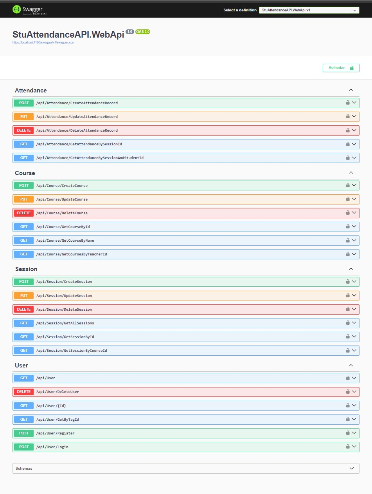
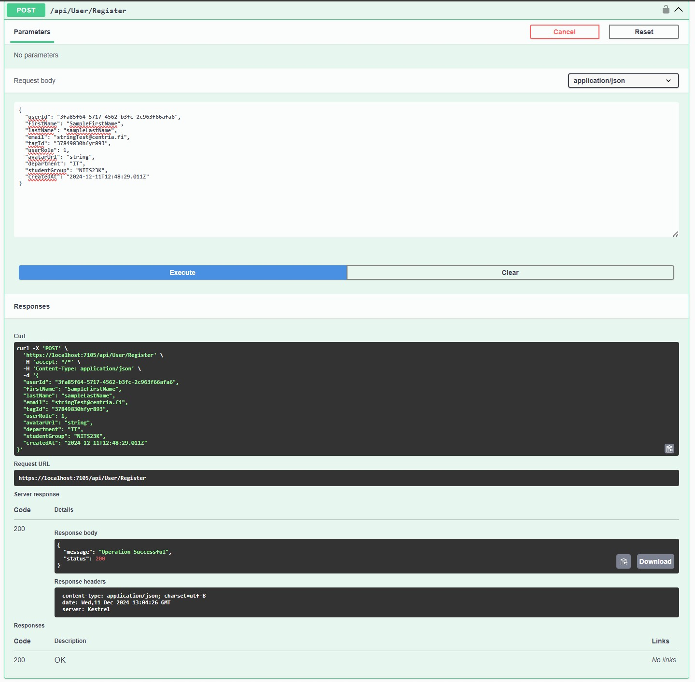
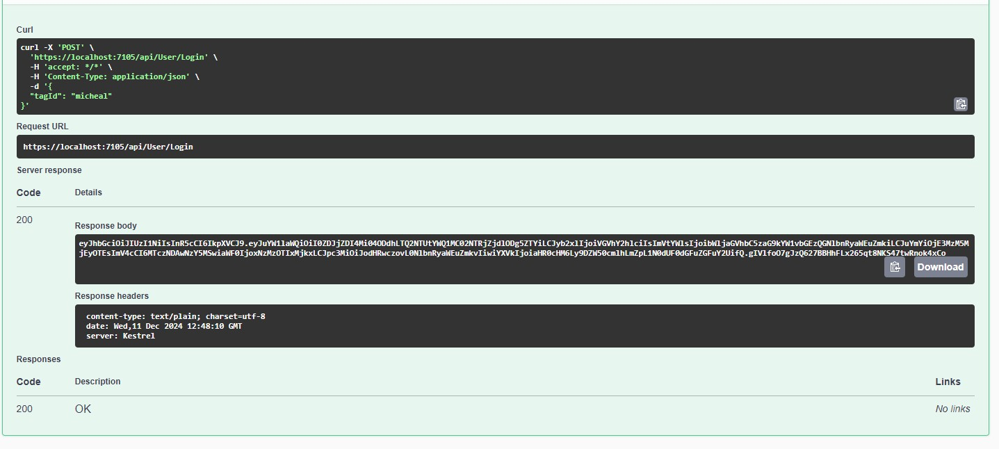

# StuAttendanceAPI (Tap-In)

StuAttendanceAPI, also known as Tap-In, is a Student Attendance API that enables teachers to manage and track student attendance information efficiently. The application follows Domain-Driven Design (DDD) principles and implements Command Query Responsibility Segregation (CQRS) through the Mediator pattern. It uses PostgreSQL as the primary database, and Dapper is utilized for Object-Relational Mapping (ORM). The project is built using **.NET 8**.

## Table of Contents

- [Features](#features)
- [Technologies Used](#technologies-used)
- [Screenshots](#screenshots)
- [Installation](#installation)
- [Usage](#usage)
- [API Endpoints](#api-endpoints)
- [Contributing](#contributing)
- [License](#license)

## Features

- **Manage Student Attendance**: Easily record, update, and retrieve attendance data for students.
- **Domain-Driven Design**: Structured codebase that aligns with complex business domains.
- **CQRS with Mediator Pattern**: Separates read and write operations for more efficient data handling.
- **High Performance**: Utilizes Dapper ORM for fast database interactions.
- **Scalable and Extensible**: Built with scalability in mind to accommodate future growth.

## Technologies Used

- **.NET 8**: The framework for building high-performance applications.
- **PostgreSQL**: An open-source relational database system.
- **Dapper**: A simple object mapper for .NET, ensuring efficient database operations.
- **CQRS**: Architectural pattern that separates command (write) and query (read) operations.
- **Mediator Pattern**: Facilitates loose coupling by encapsulating object interactions.

## Screenshots

Below are some screenshots showcasing the API endpoints and functionalities.

### Endpoints Screenshot 1


### Endpoints Screenshot 2


### Endpoints Screenshot 3


## Installation

To set up the project locally, follow these steps:

1. **Clone the Repository:**

   ```bash
   git clone https://github.com/yourusername/StuAttendanceAPI.git
   cd StuAttendanceAPI
   ```

2. **Install Dependencies:**

   Ensure you have the following installed on your machine:

   - .NET 8.0 SDK
   - PostgreSQL

3. **Set Up the Database:**

   - Create a PostgreSQL database for the application.
   - Update the connection string in the `appsettings.json` file located in `StuAttendanceAPI.WebApi` with your database credentials.

4. **Apply Database:**

   Download the database backup in the [infrastructure section](StuAttendanceAPI/StuAttendanceAPI.Infrastructure/DatabaseScript) of the codebase and perform a Restore on your postgreSql database.

5. **Build and Run the Application:**

   ```bash
   dotnet build
   dotnet run --project StuAttendanceAPI/StuAttendanceAPI.WebApi
   ```

6. **Test the API:**

   The API should now be running on `http://localhost:5000`. You can use tools like Postman or Swagger UI to interact with the endpoints.

## Usage

Once the application is running, you can perform various operations to manage students, attendance, courses, sessions, and users.

## API Endpoints

Below are the detailed API endpoints available in the StuAttendanceAPI.

### Students

- **GET** `/students`  
  Retrieve all students.

- **GET** `/students/{id}`  
  Retrieve a student by ID.

- **POST** `/students`  
  Create a new student.

- **PUT** `/students/{id}`  
  Update an existing student.

- **DELETE** `/students/{id}`  
  Delete a student.

### Attendance

- **GET** `/attendance`  
  Retrieve all attendance records.

- **GET** `/attendance/{id}`  
  Retrieve an attendance record by ID.

- **GET** `/attendance/student/{studentId}`  
  Retrieve attendance records for a specific student.

- **POST** `/attendance`  
  Create a new attendance record.

- **PUT** `/attendance/{id}`  
  Update an existing attendance record.

- **DELETE** `/attendance/{id}`  
  Delete an attendance record.

### Course

- **GET** `/api/Course`  
  Retrieve all courses.

- **GET** `/api/Course/{id}`  
  Retrieve a course by ID.

- **POST** `/api/Course`  
  Create a new course.

- **PUT** `/api/Course/{id}`  
  Update an existing course.

- **DELETE** `/api/Course/{id}`  
  Delete a course.

- **GET** `/api/Course/GetCoursesByStudentId/{studentId}`  
  Retrieve courses by student ID.

### Session

- **GET** `/api/Session`  
  Retrieve all sessions.

- **GET** `/api/Session/{id}`  
  Retrieve a session by ID.

- **POST** `/api/Session`  
  Create a new session.

- **PUT** `/api/Session/{id}`  
  Update an existing session.

- **DELETE** `/api/Session/{id}`  
  Delete a session.

- **GET** `/api/Session/GetSessionsByCourseId/{courseId}`  
  Retrieve sessions by course ID.

### User

- **GET** `/api/User`  
  Retrieve all users.

- **GET** `/api/User/{id}`  
  Retrieve a user by ID.

- **POST** `/api/User`  
  Create a new user.

- **PUT** `/api/User/{id}`  
  Update an existing user.

- **DELETE** `/api/User/{id}`  
  Delete a user.

- **POST** `/api/User/Login`  
  User login.

## Contributing

Contributions are welcome! To contribute to this project:

1. **Fork the Repository**

2. **Create a Feature Branch**

   ```bash
   git checkout -b feature/YourFeature
   ```

3. **Commit Your Changes**

   ```bash
   git commit -m "Add your feature"
   ```

4. **Push to Your Branch**

   ```bash
   git push origin feature/YourFeature
   ```

5. **Create a Pull Request**

   Submit a pull request explaining your changes.

## License

This project is licensed under the MIT License. See the [LICENSE](LICENSE) file for details.

---

For any questions or further information, please open an issue on the repository.
